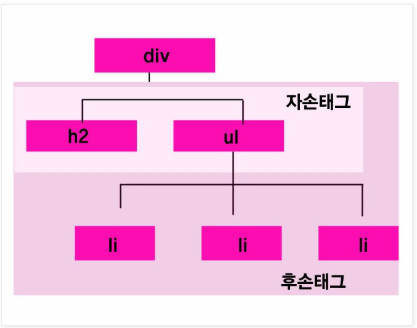

JS 연습
=====
* JS 연습 공간
* 틀린 부분이 많을 수 있음
* 나중에 작성해보기 → [URL 치고 페이지가 표시되기까지의 과정 정리](https://github.com/nara1030/TIL/blob/master/docs/thinking_list/process_when_typing_a_url.md)
- - -
## 목차
1. [JS](#JS)
	1. [DOM](#DOM)
	2. [브라우저](#브라우저)
2. [HTML](#HTML)
	1. [공간분할 태그](#공간분할-태그)
	2. [HTML5 시멘틱 구조 태그](#HTML5-시멘틱-구조-태그)
	3. [CSS3 선택자](#CSS3-선택자)
	4. [CSS3 스타일 속성](#CSS3-스타일-속성)
3. [참고](#참고)

## JS
### DOM
* DOM이란?
	* HTML, XML 문서의 프로그래밍 Interface
		* 웹 페이지를 스크립트 또는 프로그래밍 언어들에서 사용될 수 있게 연결시켜주는 역할 담당
	* [W3C DOM](https://www.w3.org/DOM/), [WHATWG DOM](https://dom.spec.whatwg.org/) 표준은 대부분의 **브라우저에서** DOM을 **구현**하는 기준
* DOM과 자바스크립트
	* API(web or XML page) = DOM + JS(scripting language)
		* DOM은 프로그래밍 언어는 아니지만 DOM이 없다면 자바스크립트 언어는 웹 페이지 또는 XML 페이지 및 요소들과 관련된 모델이나 개념들에 대한 정보를 갖지 못함
	* DOM은 프로그래밍 언어와 독립적으로 디자인
* DOM에 어떻게 접근할 수 있는가?
	* DOM을 사용하기 위해 특별히 해야 할 일은 없음
		* 모든 웹 브라우저는 자신만의 방법으로 DOM을 구현(∴ 스크립트가 접근할 수 있는 웹 페이지 만들기 가능)
	* 스크립트를 작성할 때, 문서 자체를 조작하거나 문서의 children을 얻기 위해 `document` 또는 `window` elements를 위한 API 즉시 사용 가능
* 중요한 데이터 타입들
* DOM interfaces
	1. Interface와 Object
		* 많은 objects(DOM specification)가 여러 개의 다른 interfaces와 연관되어 있음  
			```txt
			1. HTML FORM element
				- HTMLFormElement: name property
				- HTMLElement: className property
			2. table object
				- HTMLTableElement: createCaption, insertRow 등
				- HTMLElement
				- Node
			```
		* table object를 참조하면, 3가지 interfaces 사용 가능  
			```html
			var table = document.getElementById("table");
			var tableAttrs = table.attributes; // Node/Element interface
			for (var i = 0; i < tableAttrs.length; i++) {
				// HTMLTableElement interface: border attribute
				if(tableAttrs[i].nodeName.toLowerCase() == "border")
					table.border = "1"; 
			}
			// HTMLTableElement interface: summary attribute
			table.summary = "note: increased border";
			```
	2. DOM의 핵심 Interface
* DOM API 테스팅

- - -
1. DOM(Document Object Model)
2. DOM tree
3. DOM Query
4. DOM Traversing
5. DOM Manipulation
6. style

##### [목차로 이동](#목차)

### 브라우저
웹 페이지, 즉 DOM은 웹 브라우저를 통해 그 내용이 해석되어 웹 브라우저 화면에 나타나

##### [목차로 이동](#목차)

## HTML
### 공간분할 태그
왜 공간을 분할할까? 그 이유는 공간을 분할해야만 CSS를 사용해 우리가 원하는 레이아웃을 구성할 수 있기 때문이다. 대표적인 공간분할 태그는 아래와 같다.

| 태그 이름 | 설명 |
| -- | -- |
| div | block 형식으로 공간 분할 |
| span | inline 형식으로 공간 분할 |

더 상세히 분류해보면 아래와 같다.

| block 형식 태그 | inline 형식 태그 | inline-block 형식 태그 |
| -- | -- | -- |
| div | span | |
| h1~h6 | a | |
| p | input | |
| 목록 | 글자 형식 | |
| 테이블 | | |
| form | | |

##### [목차로 이동](#목차)

### HTML5 시멘틱 구조 태그
일반적으로 HTML5 태그의 가장 큰 변화를 시멘틱 태그라고 말한다. HTML5는 시멘틱 태그를 사용해 시멘틱 웹을 구현한다. 시멘틱 구조 태그의 예는 아래와 같다.

| 태그 이름 | 설명 |
| -- | -- |
| header | 헤더를 의미 |
| nav | 내비게이션을 의미 |
| aside | 사이드에 위치하는 공간을 의미 |
| section | 여러 중심 내용을 감싸는 공간을 의미 |
| article | 글자가 많이 들어가는 부분을 의미 |
| footer | 푸터를 의미 |

##### [목차로 이동](#목차)

### CSS3 선택자
CSS3은 대략 아래와 같은 선택자가 있다.

| 선택자 종류 | 선택자 형태 | 선택자 예 |
| -- | -- | -- |
| 전체 선택자 | * | * |
| 태그 선택자 | 태그 | h1 |
| 아이디 선택자 | #아이디 | #header |
| 클래스 선택자 | .클래스 | .item |
| 속성 선택자 | | |
| 후손 선택자 | 선택자 선택자 | header h1 |
| 자손 선택자 | 선택자 > 선택자 | header > h1 |
| 반응 선택자 | 선택자:hover | div:hover |
| | 선택자:active | div:active |

더 자세한 내용은 아래 링크를 참조하자.

* [CSS: 선택자(Selector) 이해](http://www.nextree.co.kr/p8468/)
* [선택자의 종류](https://opentutorials.org/module/484/4150)

##### [목차로 이동](#목차)

#### 전체 선택자
일반적으로 전체 선택자가 body 태그 내부에 있는 모든 요소를 선택한다고 생각하기 쉽다. 하지만 전체 선택자는 html 태그를 포함해 head 태그, title 태그, style 태그까지 선택한다.

##### [목차로 이동](#목차)

#### 태그 선택자
태그 선택자는 HTML 페이지 내부에서 특정 종류의 태그를 모두 선택할 때 사용하는 선택자이다. 이때 여러 개의 선택자를 한꺼번에 선택해서 스타일 속성을 적용할 때는 쉼표를 사용한다.

```html
<style>
	body, p, h1, h2, h3, h4, h5, h6 { margin: 0; padding: 0; }
</style>
```

##### [목차로 이동](#목차)

#### 아이디 선택자
아이디 선택자는 특정한 id 속성을 가지고 있는 태그를 선택할 때 사용하는 선택자이다. 한편 일반적으로 `id 속성은 웹 페이지 내부에서 중복되면 안 된다`라는 말을 듣곤 한다. 하지만 스타일시트에서는 id 속성 중복이 문제가 되지 않는다. 하지만 자바스크립트는 id 속성이 중복이 될 경우 문제가 발생하기 때문에 id 속성은 웹 페이지 내부에서 중복되지 않도록 해야 한다.

##### [목차로 이동](#목차)

#### 클래스 선택자
클래스 선택자는 특정한 클래스를 가지고 있는 태그를 선택할 때 사용하는 선택자이다. class 속성은 아래 코드(h1 태그)처럼 공백으로 구분해서 여러 클래스를 사용할 수 있다.

```html
<!DOCTYPE html>
<html>
<head>
	<title>CSS3 Selector Basic</title>
	<style>
		.item { color: red; }
		.header { background-color: blue; }
	</style>
</head>
<body>
	<h1 class="item header">Lorem ipsum</h1>
</body>
</html>
```

id 속성과는 다르게 class 속성은 웹 페이지 내에서 중복될 수 있다. 따라서 태그 선택자와 클래스 선택자를 함께 사용해 더 정확하게 태그를 선택할 수 있다.

```html
<!DOCTYPE html>
<html>
<head>
	<title>CSS3 Selector Basic</title>
	<style>
		li.select { color: red; }
	</style>
</head>
<body>
	<h1 class="select">Lorem ipsum</h1>
	<ul>
		<li class="select">Lorem ipsum</li>
		<li>Lorem ipsum</li>
		<li>Lorem ipsum</li>
		<li>Lorem ipsum</li>
	</ul>
</body>
</html>
```

##### [목차로 이동](#목차)

#### 후손 선택자
먼저 앞서 자손과 후손은 아래 그림을 보고 이해할 수 있다.

</br>

| 선택자 형태 | 설명 |
| -- | -- |
| 선택자A 선택자B | 선택자A의 후손에 위치하는 선택자B 선택 |

```html
<!DOCTYPE html>
<html>
<head>
	<title>CSS3 Selector Basic</title>
	<style>
		#header h1 { color: red; }
		#section h1 { color: orange; }
	</style>
</head>
<body>
	<div id="header">
		<h1 class="title">Lorem ipsum</h1>
		<div id="nav">
			<h1>Navigation</h1>
		</div>
	</div>
	<div id="section">
		<h1 class="title">Lorem ipsum</h1>
		<p>Lorem ipsum dolor sit amet, consectetur adipiscing elit.</p>
	</div>
</body>
</html>
```

추가로 후손 선택자 관련 주의사항은 아래와 같다. 만약 #header 태그의 후손에 위치하는 h1 태그와 #header 태그의 후손에 위치하는 h2 태그를 선택하고 싶다면 아래와 같이 사용해야 한다.

```html
<style>
	#header h1, #header h2 { color: red; }
</style>
```

##### [목차로 이동](#목차)

#### 자손 선택자
| 선택자 형태 | 설명 |
| -- | -- |
| 선택자A > 선택자B | 선택자A의 자손에 위치하는 선택자B 선택 |

후손 선택자 예의 결과에서 #nav 태그 아래에 있는 h1 태그에는 스타일 적용을 하고 싶지 않을 때 아래와 같이 작성한다.

```html
<!DOCTYPE html>
<html>
<head>
	<title>CSS3 Selector Basic</title>
	<style>
		#header > h1 { color: red; }
		#section > h1 { color: orange; }
	</style>
</head>
<body>
	<div id="header">
		<h1 class="title">Lorem ipsum</h1>
		<div id="nav">
			<h1>Navigation</h1>
		</div>
	</div>
	<div id="section">
		<h1 class="title">Lorem ipsum</h1>
		<p>Lorem ipsum dolor sit amet, consectetur adipiscing elit.</p>
	</div>
</body>
</html>
```

추가로 table 태그의 요소를 선택할 때는 자손 선택자를 사용하는 것이 좋지 않다. 웹 브라우저가 자동으로 [태그를 추가](https://otep.tistory.com/94)하기 때문이다.

##### [목차로 이동](#목차)

### CSS3 스타일 속성
* [display 속섵](https://ofcourse.kr/css-course/display-%EC%86%8D%EC%84%B1)
* [float 속성](https://ofcourse.kr/css-course/float-%EC%86%8D%EC%84%B1)
* [position 속성](https://ofcourse.kr/css-course/position-%EC%86%8D%EC%84%B1)

- - -
* [normalize.css](https://webdir.tistory.com/455)

##### [목차로 이동](#목차)

## 참고
* JS Test
	1. [w3schools](https://www.w3schools.com/html/tryit.asp?filename=tryhtml_default)
	2. [liveweave](https://liveweave.com/)
* DOM
	1. [DOM 소개](https://developer.mozilla.org/ko/docs/Web/API/Document_Object_Model/%EC%86%8C%EA%B0%9C)
	2. [DOM](https://poiemaweb.com/js-dom)
* [브라우저는 어떻게 동작하는가?](https://d2.naver.com/helloworld/59361)
* [모던 자바스크립트 튜토리얼](https://ko.javascript.info/)
* [Where should I put <script> tags in HTML markup?](https://stackoverflow.com/questions/436411/where-should-i-put-script-tags-in-html-markup)
* [제이쿼리](http://tcpschool.com/jquery/intro)
* [JavaScript로 함수형 프로그래밍 배우기 - Anjana Vakil](https://www.youtube.com/watch?v=e-5obm1G_FY&feature=youtu.be)
	* [An introduction to functional programming](https://codewords.recurse.com/issues/one/an-introduction-to-functional-programming)
	* [Rambda](https://ramdajs.com/)
	* [Immutable collections for JavaScript](https://immutable-js.github.io/immutable-js/)
	* [mori](http://swannodette.github.io/mori/)
* .

##### [목차로 이동](#목차)
